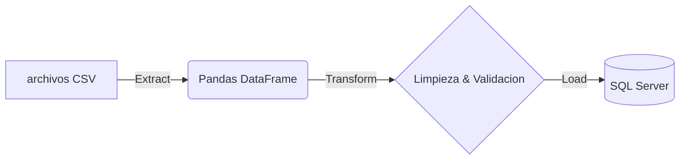
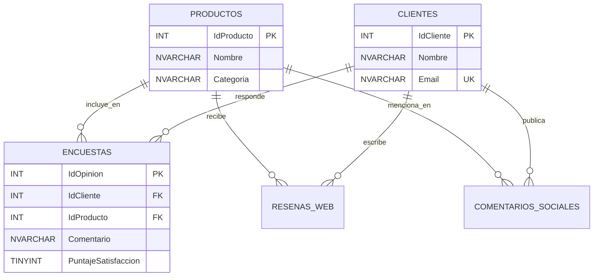

# 📊 Customer Opinion ETL Pipeline


Un pipeline **ETL (Extract, Transform, Load)** robusto desarrollado en Python para procesar, limpiar y centralizar datos de opiniones de clientes (encuestas, comentarios sociales y reseñas web) en una base de datos relacional (SQL Server).

## 🚀 Arquitectura del Proyecto

El proceso ETL sigue este flujo:

1.  **Extracción:** Lectura de múltiples fuentes de datos estructuradas (archivos CSV).
2.  **Transformación:** Limpieza de datos con `Pandas` (eliminación de duplicados, normalización de textos, estandarización de columnas).
3.  **Validación de Integridad:** Verificación en memoria de llaves foráneas para evitar fallos de constraint durante la carga.
4.  **Carga:** Inserción masiva en SQL Server usando `SQLAlchemy` y `pyodbc`.



## 📁 Estructura del Repositorio

```text
├── .gitignore                   # Archivos ignorados por git
├── requirements.txt             # Dependencias del proyecto
├── README.md                    # Documentación
└── customer_opinion_system/     # Código fuente principal
    ├── config.py                # Variables de entorno y configuración
    ├── etl_pipeline.py          # Script principal del pipeline ETL
    ├── create_database.sql      # Script DDL para creación de BD y tablas
    ├── consultation_queries.sql # Consultas de prueba y análisis
    └── data/                    # (Ignorado) Carpeta con archivos CSV fuente
```

## 🛠️ Tecnologías y Librerías

*   **Lenguaje:** Python 3
*   **Manipulación de Datos:** `pandas`, `numpy`
*   **Base de Datos:** SQL Server, T-SQL
*   **Conexión a BD:** `SQLAlchemy`, `pyodbc`
*   **Monitoreo y UI:** `logging`, `tqdm` (para barras de progreso animadas)

## ⚙️ Instalación y Uso

### 1. Configurar la Base de Datos
Abre tu gestor de base de datos (SSMS, Azure Data Studio) conectado a tu SQL Server local y ejecuta el script `customer_opinion_system/create_database.sql`. Esto creará la base de datos `CustomerOpinions` y todas las tablas necesarias.

### 2. Preparar el Entorno Virtual
Se recomienda crear un entorno virtual para instalar las dependencias:
```bash
# Clonar repositorio
git clone <tu-url-del-repositorio>
cd ETL-Code-Python.-Proceso-de-ETL...

# Instalar requerimientos
pip install -r requirements.txt
```

### 3. Ejecutar el Pipeline
Navega a la carpeta principal del código y ejecuta el proceso ETL. El script mostrará una barra de progreso animada detallando la fase actual:
```bash
cd customer_opinion_system
python etl_pipeline.py
```
*(Se generará un archivo `etl_process.log` para revisar cualquier detalle de la ejecución).*

## 📊 Diagrama Entidad-Relación (Base de Datos)


---
*Desarrollado para fines de demostración de habilidades de Data Engineering y ETL.*
